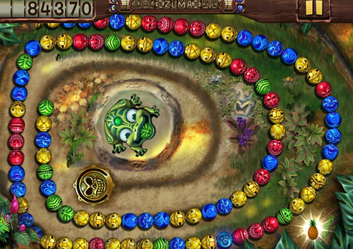

# AI Zuma Agent: Maximizing Score with Probabilistic Decision-Making

This project showcases an AI controller designed to play a variant of the Zuma game. The controller leverages principles inspired by **Markov Decision Processes (MDPs)** to make optimal decisions under uncertainty, aiming to maximize the player's score within a fixed number of steps.


---

## Project Overview

**Objective:** Develop an intelligent agent capable of analyzing the probabilistic Zuma game environment and selecting the best action (inserting a ball at a specific position or skipping the turn) at each step to achieve the highest possible score.



**Game Variant Mechanics:**
*   A row of colored balls needs to be cleared by shooting new balls into the row.
*   **Probabilistic Pops:** Sequences of 3 or more identical balls *may* pop when a matching ball is inserted nearby, based on color-specific probabilities. This can trigger chain reactions. Pre-existing sequences do not pop automatically.
*   **Probabilistic Insertion:** The success of inserting a ball at the chosen location is probabilistic and depends on the ball's color. Failed insertions result in the ball being placed randomly elsewhere (or skipped).
*   **Probabilistic Next Ball:** The color of the next ball to shoot is drawn from a defined probability distribution.
*   **Scoring System:** Points are awarded for popping balls (with bonuses for larger groups). Penalties are applied for balls remaining at the end, and a large bonus is given for clearing the entire row.
*   **Fixed Horizon:** The game lasts for a predetermined number of steps.

**The Challenge:** The core challenge lies in making optimal decisions in a stochastic environment where actions (insertion success, pops) and state transitions (next ball color) are governed by probabilities. The agent must balance immediate rewards with long-term goals (clearing the row, avoiding penalties).

---

## Controller Implementation (`zuma_mdp_controller.py`)

The `Controller` class acts as the brain of the Zuma player.

*   **Input:** Takes the current game state (ball row, current ball, steps remaining) and the game's probabilistic model.
*   **Core Logic (`choose_next_action`):**
    *   Iterates through all possible actions: inserting the current ball at each possible position ( `0` to `len(row)`) or skipping the turn (`-1`).
    *   **Heuristic Evaluation (`_evaluate_position`):** For each potential action, it calculates a heuristic score estimating the action's desirability. This evaluation considers:
        *   **Expected Pop Reward:** Calculates the potential score from immediate pops, weighted by both the `chosen_action_prob` (success of insertion) and the `color_pop_prob` (success of the pop).
        *   **Chain Reaction Potential:** Implicitly handled by simulating pops (`_simulate_pop` within the game logic, which the controller can call on a copy or analyze). The heuristic rewards actions leading to pops.
        *   **Future Opportunities:** Considers near-matches (pairs) and the probability of getting the needed color next, estimating potential future pops.
        *   **Strategic Positioning:** Favors positions that might lead to better future states (e.g., near the middle, configurable).
        *   **End-Game Awareness:** Adjusts strategy as the game nears its end, potentially prioritizing clearing or avoiding specific color penalties.
        *   **Penalty Avoidance:** Factors in the negative rewards for leaving balls of specific colors.
    *   **Caching:** Uses a cache (`self.cache`) to store results of pop simulations (`_simulate_pop`) for efficiency.
*   **Output:** Returns the index corresponding to the action with the highest heuristic score.

---

## Key Features & Techniques

*   **MDP-Inspired Heuristics:** While this is not a full MDP solver—since exhaustively solving the state space would be computationally intractable—the controller leverages MDP-inspired expected value calculations to guide its heuristic evaluation and decision-making.
*   **Probabilistic Reasoning:** Explicitly incorporates the game's probabilities (`chosen_action_prob`, `next_color_dist`, `color_pop_prob`) into its decision-making.
*   **Simulation & Lookahead (Limited):** Evaluates immediate consequences of actions, including potential pops and their rewards.
*   **Adaptive Strategy:** The heuristic considers the game stage (remaining steps) and adjusts priorities accordingly.
*   **Efficiency:** Uses caching to avoid redundant calculations.

---


## File Structure

| File                     | Description                                                                     |
|--------------------------|---------------------------------------------------------------------------------|
| `zuma_mdp_controller.py` | **(Your Implementation)** Controller logic using MDP-inspired heuristics.     |
| `zuma.py`                | Contains the `Game` class implementing the Zuma game logic and MDP model.       |
| `check_zuma_mdp.py`      | **(Provided)** Script for testing the controller and evaluating its performance. |

*(Ensure you rename your `ex2.py` file to `zuma_mdp_controller.py`)*

---

## How to Run

1.  Ensure you have Python 3 installed.
2.  Place `zuma_mdp_controller.py`, `zuma.py`, and `check_zuma_mdp.py` in the same directory.
3.  Run the testing script from your terminal:

    ```bash
    python3 check_zuma_mdp.py
    ```
    This script will initialize the game with a specific configuration, use your `Controller` to play the game, and report the final score and potentially the sequence of actions taken (if debugging is enabled in the test script).
